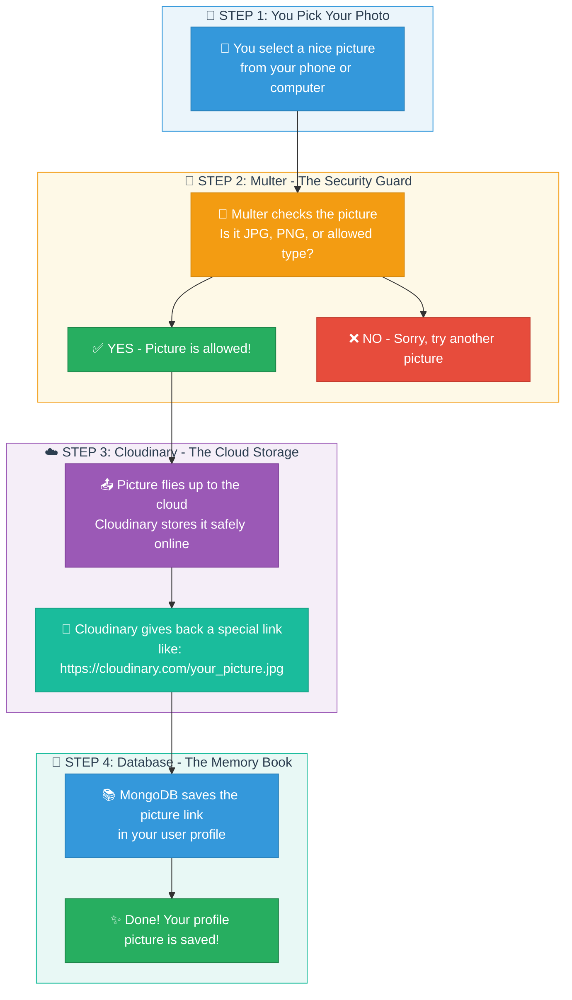

# 📸 How Profile Picture Upload Works

## Simple Explanation (Like Explaining to a 10-Year-Old Nigerian)

Imagine you want to change your WhatsApp profile picture. This is how our code does something similar!

---

## 🎯 The Journey of Your Profile Picture



---

## 🧒 Simple Story Time!

### **Imagine This Scenario:**

You're a student at a school in Lagos. You want to put your passport photo on your school ID card. Here's what happens:

---

### **1️⃣ STEP 1: You Bring Your Photo**
Just like when your mama gives you a passport photo to take to school, you SELECT a picture from your phone or computer. You send this picture to the website.

**In the code:** This happens when you make a request to:
```
PUT /api/users/upload-profile-picture
```

---

### **2️⃣ STEP 2: Multer - The Security Guard 🚪**

**What is Multer?** Think of Multer like the security man (gate man) at your school!

Before you enter the school compound, the security man checks:
- "Is this really a student?" ✅
- "Are you wearing the correct uniform?" ✅

**Multer does the same thing for pictures!** It checks:
- "Is this really a picture?" (JPG, PNG, etc.) ✅
- "Is the file type allowed?" ✅

**If the picture is wrong type** (like trying to upload a video game file), Multer says:
> "Oya comot! This file type is not allowed!" ❌

**In the code** ([multer.js](src/config/multer.js)):
```javascript
const allowedExtensions = ['.jpg', '.jpeg', '.png', '.mp4', '.mov', '.avi', '.pdf', '.docx'];

// If the file type is not in this list, Multer rejects it!
if (allowedExtensions.includes(ext.toLowerCase())) {
  cb(null, true);  // "Enter! You're allowed!"
} else {
  cb(new Error('File type is not supported'), false);  // "Sorry, no entry!"
}
```

---

### **3️⃣ STEP 3: Cloudinary - The Cloud Storage ☁️**

**What is Cloudinary?** Think of Cloudinary like **Google Drive** or **iCloud** - but specially made for pictures and videos!

Imagine you have a very important photograph. Instead of keeping it in your house (where it can tear or get lost), you send it to a safe place in the sky (the cloud ☁️) where it's kept forever!

**Cloudinary does this:**
1. Takes your picture
2. Stores it safely on the internet
3. Gives you back a special **link (URL)** to find your picture anytime

It's like sending your photo to a professional photographer's studio. They keep it safe and give you a receipt (the URL) to collect it anytime!

**In the code** ([cloudinary.js](src/config/cloudinary.js)):
```javascript
// This is like giving Cloudinary your "key" to access your storage space
cloudinary.config({
    cloud_name: process.env.CLOUDINARY_CLOUD_NAME,    // Your storage name
    api_key: process.env.CLOUDINARY_API_KEY,          // Your secret key
    api_secret: process.env.CLOUDINARY_API_SECRET,    // Your super secret password
});
```

**When uploading** ([user.controller.js](src/controller/user.controller.js)):
```javascript
const uploadResult = await cloudinary.uploader.upload(req.file.path, {
    folder: "profile_pictures",           // Like creating a folder called "Profile Pictures"
    public_id: `user_${userId}_profile`,  // Naming your file with your unique ID
});

// Cloudinary returns something like:
// uploadResult.secure_url = "https://res.cloudinary.com/.../user_123_profile.jpg"
```

---

### **4️⃣ STEP 4: MongoDB Database - The Memory Book 📚**

**What is the Database?** Think of it like your school's **record book** or **register**!

Your school has a big book where they write:
- Your name
- Your class
- Your parent's phone number
- **Your passport photo** (or where to find it!)

Our database (MongoDB) is the same! It keeps all your information, including the **link** to your profile picture.

**We don't save the actual picture in the database** (that would be too heavy, like putting the actual photo in the register). Instead, we save the **link** (URL) that points to where the picture is stored on Cloudinary.

**In the code** ([user.models.js](src/models/user.models.js)):
```javascript
profilePicture: {
    type: String,      // We save the link as text (string)
    default: null,     // If no picture yet, it's empty
},
```

**Saving the link** ([user.controller.js](src/controller/user.controller.js)):
```javascript
user.profilePicture = uploadResult.secure_url;  // Save the Cloudinary link
await user.save();  // Update the user's record in the database
```

---

## 🔄 The Complete Journey (Summary)

```
You → Multer (Security Check) → Cloudinary (Cloud Storage) → MongoDB (Save Link)
```

| Step | What Happens | Nigerian Example |
|------|--------------|------------------|
| 1️⃣ | You select a photo | You bring your passport photo to school |
| 2️⃣ | Multer checks the file | Security guard checks if it's a real photo |
| 3️⃣ | Cloudinary stores it | Photo studio keeps it safe, gives you receipt |
| 4️⃣ | MongoDB saves the link | School register writes down where your photo is |

---

## 🛤️ The Route - How It All Connects

In [user.routes.js](src/routes/user.routes.js):
```javascript
router.put('/upload-profile-picture', 
    isAuth,                              // First, check if you're logged in
    upload.single('profilePicture'),     // Then, Multer handles the file
    uploadProfilePicture                 // Finally, upload to Cloudinary and save to DB
);
```

**Reading this like a story:**
1. `isAuth` - "Are you logged in? Show me your ID!"
2. `upload.single('profilePicture')` - "Let Multer check your picture!"
3. `uploadProfilePicture` - "Now let's upload to Cloudinary and save it!"

---

## 🎉 And That's It!

Now when you or anyone visits your profile, the app:
1. Goes to the database
2. Finds your profile picture link
3. Shows the picture from Cloudinary!

**Just like when you want to see your photo in the school record, they check the register and show you!** 📸✨
